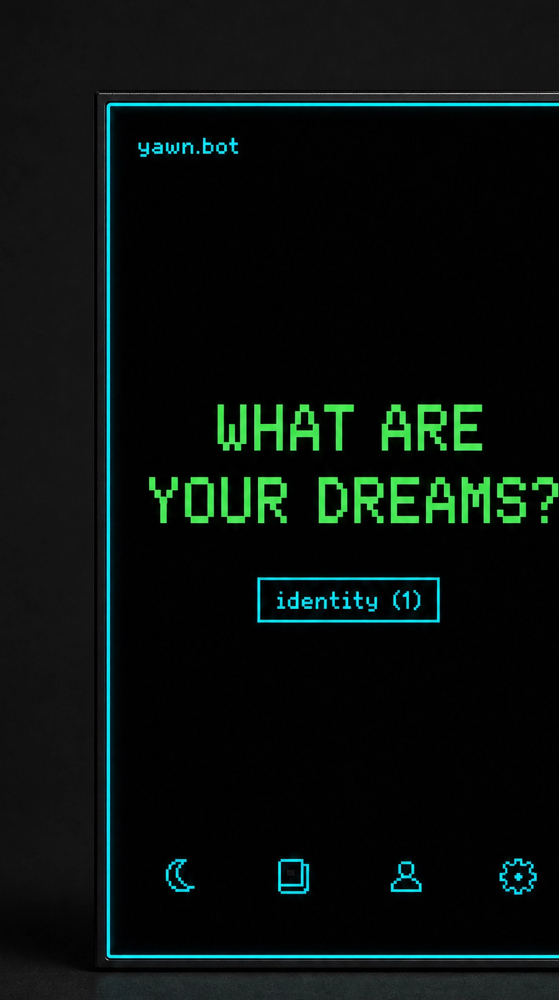
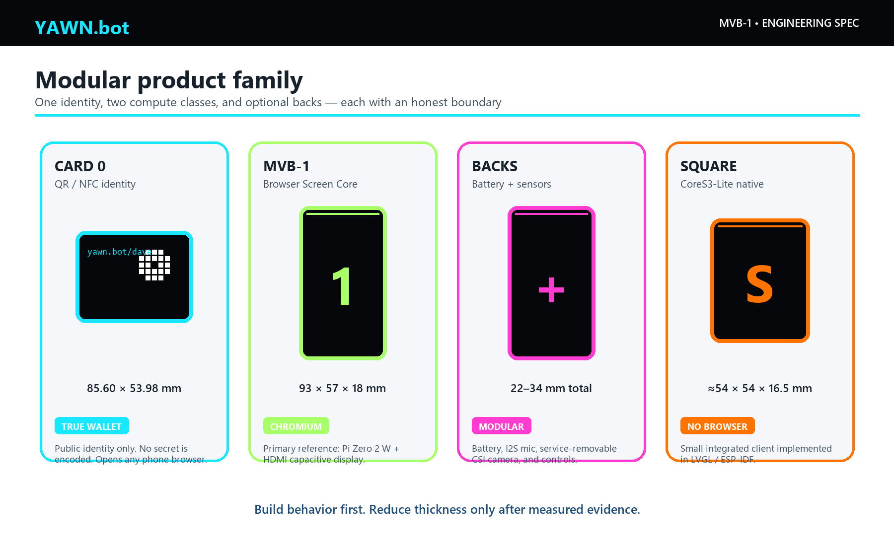
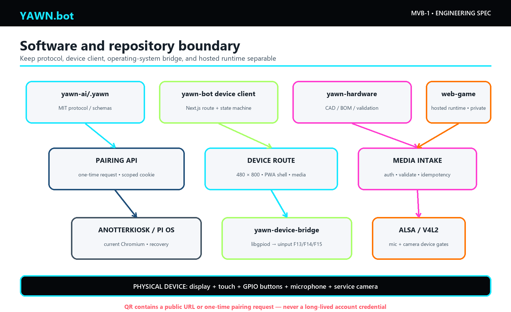
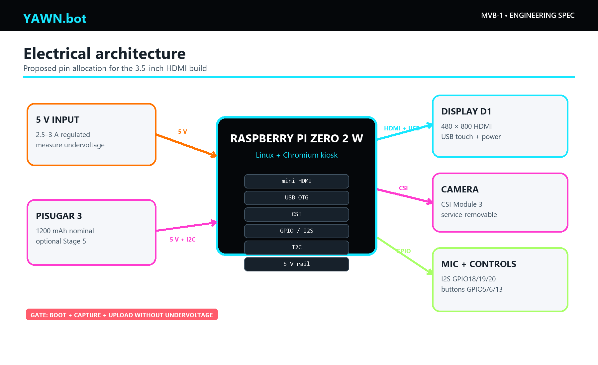
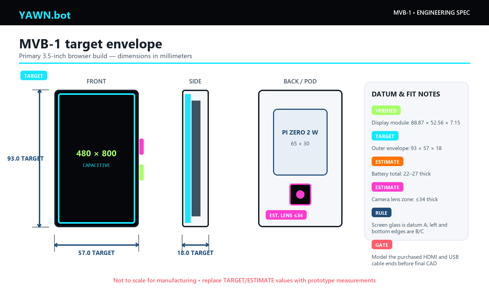
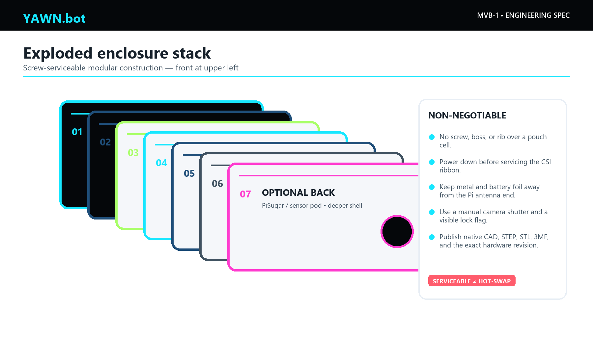
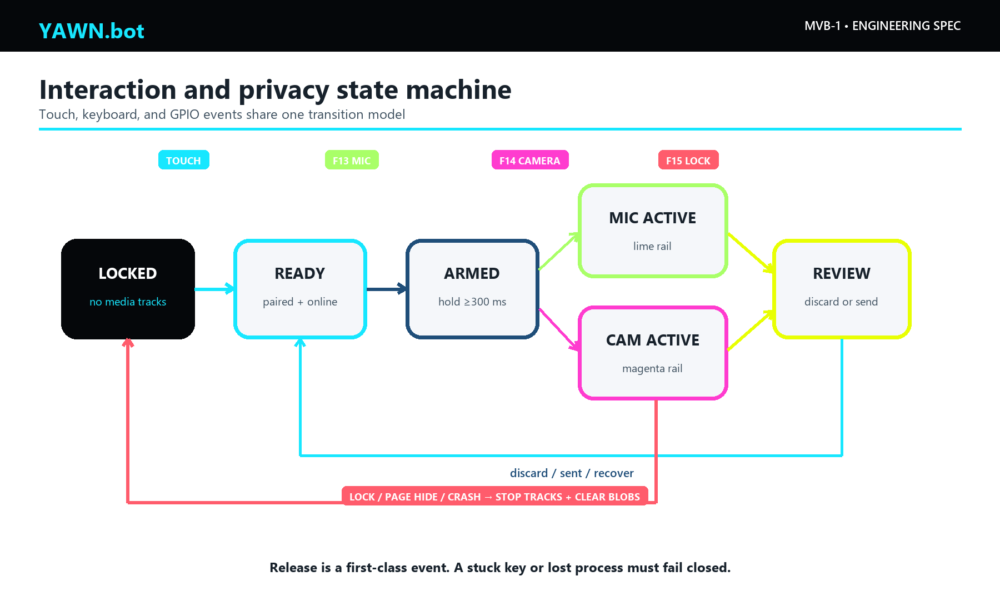
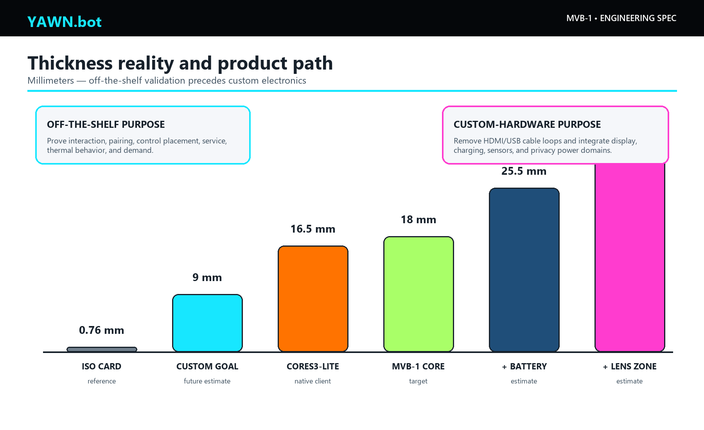

# YAWN.bot MVB-1

## Engineering specification and open-source build plan

**Document ID:** YB-MVB1-ES-001  
**Revision:** 1.0 — prototype release  
**Date:** 11 July 2026  
**Owner:** YAWN.bot / yawn-ai  
**Status:** Buildable reference architecture; physical prototype validation required  
**Primary build:** Browser Card, USB-powered Screen Core  



*Figure 1. Original YAWN.bot rendering. It establishes the black enclosure, edge-to-edge screen, thin cyan status rail, and two right-edge controls. It is not evidence of component fit, thickness, thermal behavior, or manufacturability.*

> **The engineering decision:** build the first real YAWN.bot as a card-shaped Raspberry Pi browser terminal, not as an ESP32 pretending to be a browser. Preserve a true wallet form through a separate QR/NFC identity card, and use M5Stack CoreS3-Lite only for the optional square native-client edition.

---

# 1. Purpose and truth standard

This document replaces the earlier *yawn.bot DIY Build Guide*. It defines a product that a technically capable builder can assemble from purchasable modules, a 3D-printed enclosure, and open-source software. It also identifies every important feature that is still a target rather than a verified result.

In product terms, MVB-1 is the minimum viable physical interface for the YAWN Holarchy: a portable identity surface, an orientation screen, controlled microphone/camera capture, and a focused browser window into the hosted system.

Four evidence labels are used throughout:

| Label | Meaning |
|---|---|
| **VERIFIED** | Confirmed from an authoritative datasheet, source repository, or inspected implementation. |
| **TARGET** | A design requirement for the prototype. It must be measured on the assembled unit. |
| **ESTIMATE** | A planning value derived from published component data or layout arithmetic. It is not a supplier guarantee. |
| **GATE** | A test that must pass before the next build stage or a public claim. |

The product is deliberately described as a **card-shaped pocket terminal** or **wallet replacement**. An ISO/IEC 7810 ID-1 payment card is 85.60 × 53.98 × 0.76 mm. No off-the-shelf Linux browser, display, battery, camera, and enclosure can fit within that thickness. The first browser unit is therefore pocketable, not wallet-insert thin.

# 2. Executive specification

## 2.1 Product family



*Figure 2. The product family separates the truly wallet-thin identity layer from the browser terminal and from the smaller native-client alternative.*

| Product | Purpose | Compute and display | Target envelope | Browser? | Build status |
|---|---|---|---|---|---|
| **YAWN Card 0** | Wallet identity, pairing, and fallback access | Printed QR plus optional NFC tag | 85.60 × 53.98 × 0.8–1.2 mm | Opens the user’s phone browser | Ready to prototype |
| **MVB-1 Screen Core** | Lowest-risk dedicated YAWN.bot interface | Raspberry Pi Zero 2 W + 3.5-inch 480 × 800 capacitive HDMI display | 93 × 57 × 18 mm **TARGET** | Yes, Chromium kiosk | Reference build in this document |
| **MVB-1 Battery Back** | Untethered use | PiSugar 3, 1200 mAh nominal | 93 × 57 × 25.5 mm total **ESTIMATE** | Yes | Prototype after USB build passes |
| **MVB-1 Sensor Back** | Microphone, camera, physical controls | I2S microphone + CSI camera + buttons | Lens zone up to 34 mm total **ESTIMATE** | Yes, through OS devices | Integration gates remain |
| **YAWN Square Native** | Smallest integrated demo | M5Stack CoreS3-Lite, 2-inch 320 × 240 touch, camera, dual mic, Wi-Fi | About 54 × 54 × 16.5 mm | **No**; LVGL/native client | Parallel firmware project |

## 2.2 What the first release must do

The MVB-1 release is complete only when it can:

1. Boot directly into a current Chromium kiosk at a dedicated YAWN.bot device route.
2. Join 2.4 GHz Wi-Fi and recover after a connection loss.
3. Render the YAWN.bot interface at 480 × 800 with a continuous software status rail at the display perimeter.
4. Pair without putting a long-lived credential in a QR code.
5. Accept touch and physical press/release controls through one interaction state machine.
6. Record real microphone audio while held, stop on release, and stop immediately on lock.
7. Capture a camera image only after the camera integration gate passes.
8. Present an offline-status shell when the network is unavailable.
9. Be serviceable with screws, not a sealed snap-fit around a lithium pouch cell.

The first release does **not** promise offline AI, a full offline capture queue, payment-card thickness, all-day battery life, hot-swappable CSI camera ribbons, or a general Android-like app platform.

## 2.3 Primary physical targets

| Attribute | Requirement | Evidence |
|---|---|---|
| Screen Core outer size | 93.0 × 57.0 × 18.0 mm | **TARGET**; dimensioned CAD required |
| Battery configuration | 93.0 × 57.0 × 22–27 mm | **ESTIMATE** until cable and cell stack are measured |
| Mass, Screen Core | 90–110 g | **ESTIMATE** |
| Mass, battery/sensor build | 120–160 g | **ESTIMATE** |
| Display active resolution | 480 × 800, portrait | **VERIFIED** supplier specification |
| Touch | Five-point capacitive USB touch | **VERIFIED** supplier specification |
| Wi-Fi | 2.4 GHz 802.11 b/g/n | **VERIFIED** Pi Zero 2 W specification |
| External power | Regulated 5 V, 2.5–3 A | **TARGET** system input |
| Battery runtime | 0.7–1.5 h at prototype load | **ESTIMATE**; brightness and workload strongly affect it |
| Cold boot to usable UI | Under 45 s | **TARGET / GATE** |
| Physical press-to-screen response | Under 100 ms | **TARGET / GATE** |
| Enclosure surface temperature | Under 45 °C at 25 °C ambient | **TARGET / GATE** |

# 3. Why the previous guide could not produce the rendering

The earlier guide made a correct product observation—the device can be a focused terminal—but selected hardware that cannot execute the stated software.

## 3.1 Corrected claims

| Earlier claim | Engineering finding | Replacement |
|---|---|---|
| An ESP32-S3 can load the existing YAWN.bot web interface in a browser | ESP32-S3 has no Chromium/WebKit-class engine and cannot execute an arbitrary Next.js/DOM/CSS application | Use Raspberry Pi/Linux for the browser build; use a purpose-built LVGL client for ESP32 |
| The `.yawn` repository contains ESP32 firmware and case STL folders | The inspected repository contains the public protocol/content; the named `firmware/` and `case/stl/` paths do not exist | Create a separate public device client and hardware repository after review |
| A generic OV2640 ribbon camera plugs into the recommended T-Display-S3 | Camera pinout, firmware, connector, and enclosure compatibility are board-specific | Use the Pi CSI camera reference or the CoreS3-Lite integrated camera |
| A $25–45 build provides browser, battery, camera, microphone, and case | The display alone is approximately $45; the complete modular prototype is closer to $150–190 | Publish a line-item BOM and measure the finished build |
| A 1-pixel slot can be printed into the case | One display pixel is about 0.18 mm on the chosen screen; ordinary FDM printing cannot make a clean literal 1-pixel aperture | Render a 2-device-pixel rail on the LCD behind a 1.0–1.2 mm bezel lip |
| The terminal is inherently secure because it stores no data | Browsers retain cookies, caches, media permissions, logs, and possibly uploads | Use device-scoped credentials, revocation, kiosk hardening, and explicit media cleanup |

## 3.2 The browser boundary

An ESP32-S3 is excellent for a small native appliance. Its dual-core 240 MHz MCU, integrated Wi-Fi, flash, and PSRAM can run ESP-IDF, Arduino, or LVGL. It is not a general-purpose Linux computer and has no supported modern browser engine [S06]. A native YAWN Square client can still exchange compact protocol messages, display QR codes, record short audio, and show the status rail, but it requires its own interface implementation.

The Pi Zero 2 W is the smallest widely supported off-the-shelf board in this project that can run current Linux and Chromium. It provides a 1 GHz quad-core Cortex-A53, 512 MB RAM, 2.4 GHz Wi-Fi, Bluetooth, mini HDMI, USB OTG, a CSI camera connector, and a 65 × 30 mm board footprint [S01]. Its memory is limited, so the device route must remain lightweight.

# 4. System architecture



*Figure 3. Repository and runtime boundaries. A dedicated device route consumes the public `.yawn` protocol; the operating-system bridge converts GPIO events into standard key events.*

## 4.1 Repository roles

| Repository or codebase | Current finding | Intended role |
|---|---|---|
| `github.com/yawn-ai/.yawn` | Public, MIT; protocol/content repository. No browser firmware or enclosure CAD was found. | Canonical open protocol, schemas, examples, device capability vocabulary |
| Local `yawn-bot` prototype | MIT metadata; Next.js 16.2.10; contains `/dave/wallet/v1`, QR route, responsive projections, and tested interaction states. It has no configured remote and contains uncommitted work. | Seed for the public browser-device client after owner review and sanitization |
| `yawn-ai/web-game` | Current hosted Next.js runtime; inspected repository is private and has no visible license. | Existing hosted experience; it is not yet an open-source dependency |
| AnotterKiosk | GPL-3.0 Raspberry Pi kiosk distribution | Reproducible Pi kiosk base, or a reference for a hardened Raspberry Pi OS setup [S07] |
| `yawn-device-bridge` | Not yet created | Small GPL-compatible service: GPIO via `libgpiod`, key events via `uinput`, health endpoint, lock cleanup |
| `yawn-hardware` | Not yet created | CAD sources, drawings, print profiles, wiring, fixture tests, release STLs, license notices |

The exact repository name is **`yawn-ai/.yawn`**. The variants `yawm-ai/.yawm`, `yawn-ai/.yawm`, and `yawm-ai/.yawn` did not resolve during this audit.

## 4.2 Dedicated web route

The browser should load a small route such as `/device` or the existing prototype route `/dave/wallet/v1`. It should not load game engines, 3D libraries, admin dashboards, or large agent orchestration bundles. Required viewports are:

- 480 × 800: primary portrait screen.
- 480 × 640: compact portrait fallback.
- 480 × 480: square/native design reference.
- 856 × 540: card projection used by the inspected prototype.
- 390 × 844 and 844 × 390: phone fallbacks.

The local `yawn-bot` prototype already implements a useful `locked → armed → recording → review → sending → locked` state sequence and Playwright viewport coverage. Its current recording visual is simulated. The production route must replace the timer with real `getUserMedia()` and `MediaRecorder` behavior [S08].

# 5. Hardware reference design

## 5.1 Primary BOM — Screen Core

Prices are planning ranges in USD, before tax and shipping, and must be checked on the day of purchase. Amazon URLs use stable ASIN links where one was verified; seller and included accessories can change.

| Ref | Part | Required specification | Source | Planning cost | Evidence / caveat |
|---|---|---|---|---:|---|
| C1 | Raspberry Pi Zero 2 W | 512 MB, Wi-Fi, mini HDMI, CSI, unsoldered or low-profile header | [Official][S01]; [Amazon board][A01] | $25–42 | **VERIFIED** board size 65 × 30 mm; buy from an established seller |
| D1 | Waveshare 3.5-inch 480 × 800 LCD, SKU 24037 | Capacitive touch, HDMI video, USB touch/power | [Official][S02]; [Amazon][A02] | $45–55 | **VERIFIED** module 88.87 × 52.56 × 7.15 mm; up to 2 W |
| S1 | 16–32 GB microSD | A1/A2 application rating, reputable brand | Amazon/local | $8–15 | Image and endurance must be tested |
| V1 | Flexible mini-HDMI-to-HDMI interconnect | Short, right-angle or flex geometry | Amazon/electronics supplier | $8–18 | **GATE:** connector bend radius controls thickness; choose after fit fixture |
| U1 | Micro-USB OTG to USB-C data/power lead | Short, supports data; no charge-only cable | Amazon/electronics supplier | $6–12 | Connects Pi OTG to display USB touch/power |
| P1 | 5 V regulated supply | 2.5–3 A, known cable voltage drop | Amazon/local | $10–15 | USB-powered prototype first |
| H1 | Enclosure hardware | M2 heat-set inserts and screws, M2.5 Pi standoffs | Amazon/local | $5–10 | Keep metal outside Wi-Fi antenna keepout |
| M1 | Printed Screen Core enclosure | PETG or ASA, 0.2 mm layers | Local print | $3–10 material | Source CAD, not only STL, must be published |

**Screen Core planning total:** approximately **$105–150** including storage, interconnects, power supply, fasteners, and printed parts. A builder who already owns a supply and microSD may spend less.

## 5.2 Battery Back

| Ref | Part | Required specification | Source | Planning cost | Evidence / caveat |
|---|---|---|---|---:|---|
| B1 | PiSugar 3 | 1200 mAh nominal, Zero footprint, power-management interface | [Official][S03]; [Amazon][A03] | $40–50 | Confirm exact Pi Zero 2 W revision and standoff stack |
| B2 | Battery enclosure hardware | Screw-retained back; no fastener above pouch | Local/Amazon | $3–8 | Printed battery cavity needs 0.5 mm XY and 1.0 mm Z allowance |

The cell is approximately 4.44 Wh nominal. After conversion loss, available energy is roughly 3.6–4.0 Wh. A 3.5–5.5 W system load therefore implies about 0.7–1.1 hours; lower brightness and idle states may approach 1.5 hours. Runtime is a **GATE**, not a marketing claim.

Do not charge this prototype inside a sealed pocket or under bedding. PiSugar documentation warns that high charge current produces heat; the enclosure must vent and temperature must be measured [S03].

## 5.3 Sensor and control parts

| Ref | Part | Required specification | Source | Planning cost | Evidence / caveat |
|---|---|---|---|---:|---|
| A1 | Adafruit SPH0645LM4H I2S MEMS microphone, PID 3421 | 3.3 V I2S, bottom port | [Product][S04]; [Pi guide][S05] | $7–10 | Board 16.7 × 12.7 × 1.8 mm; Pi driver setup required |
| K1, K2 | Momentary tactile switches | Normally open, side actuation or low profile | Amazon/electronics supplier | $3–8 | Camera and microphone hold controls |
| K3 | Latching slide switch | Distinct top-edge actuator with red locked flag | Amazon/electronics supplier | $2–5 | V1 is software privacy lock; do not label as a hard sensor disconnect |
| CAM1 | Raspberry Pi Camera Module 3 | 12 MP autofocus | [Official][S09] | $25–35 | Requires correct Zero 22-to-15-pin cable |
| CAM2 | Arducam Camera Module 3 kit B0312 | Camera plus Zero-compatible cable | [Amazon][A04] | $30–40 | Convenient sourced option; verify seller contents |
| W1 | 28–30 AWG silicone wire, heat-shrink, small perfboard | Internal harness | Amazon/local | $5–12 | Strain-relieve all wires and ribbon cable |

**Full battery/sensor build planning total:** approximately **$150–195**. Tools, solder, printer ownership, failed fit iterations, and shipping are excluded.

## 5.4 Compact experimental display

Waveshare’s 2.8-inch DPI LCD is physically attractive: 480 × 640, five-point capacitive touch, 65.70 × 47.90 mm module, and approximately 0.8 W published display power [S10]. It can reduce the case footprint toward 72 × 54 mm. However, its DPI666 interface consumes most of the Pi’s 40-pin GPIO, colliding with easy I2S microphone and button wiring. It is therefore a **screen-only experimental branch**, not the full-sensor reference build. Promote it only after an I/O expander and audio plan pass bench tests.

## 5.5 Native square option

M5Stack CoreS3-Lite is the most coherent off-the-shelf square YAWN.bot: ESP32-S3, 2-inch 320 × 240 capacitive display, 0.3 MP camera, dual microphones, speaker, Wi-Fi, microSD, sensors, 200 mAh battery, and a compact enclosure [S11]. It can closely approach a 54 mm square and needs much less assembly.

It must run a native LVGL/ESP-IDF application. It cannot open the existing Next.js browser interface. Its role is a constrained protocol client: pairing QR, prompt/response cards, press-to-talk, still-image capture, status rail, and network state. This is a valuable second product, not a cheaper substitute for MVB-1 browser compatibility.

# 6. Electrical architecture



*Figure 4. Primary MVB-1 connections. Dashed blocks are optional stages. All GPIO assignments are a proposed allocation and must be validated on the assembled harness.*

## 6.1 Proposed connections

| Function | Pi connection | Destination | Notes |
|---|---|---|---|
| Display video | Mini HDMI | Full HDMI on D1 | Use shortest mechanically safe interconnect |
| Display touch and power | USB OTG micro-B | USB-C on D1 | Data-capable cable; Pi 5 V rail supplies display |
| External power | Micro-USB PWR IN | 5 V, 2.5–3 A | Measure voltage at Pi and display during camera start |
| Camera | 22-pin CSI | 15-pin Camera Module 3 via Zero cable | Power down before service; CSI is not hot-swappable |
| Microphone bit clock | GPIO18, pin 12 | SPH0645 BCLK | Proposed I2S allocation |
| Microphone word select | GPIO19, pin 35 | SPH0645 LRCLK/WS | Proposed I2S allocation |
| Microphone data | GPIO20, pin 38 | SPH0645 DOUT | Proposed I2S allocation |
| Microphone power | 3.3 V + GND | SPH0645 | Never apply 5 V logic/power to the microphone |
| Camera hold | GPIO5, pin 29 | Active-low switch to GND | Enable internal pull-up; add software debounce |
| Microphone hold | GPIO6, pin 31 | Active-low switch to GND | Press and release must both be emitted |
| Privacy lock | GPIO13, pin 33 | Active-low latching switch to GND | Software privacy in V1 |
| Battery manager | GPIO2/3 I2C, 5 V, GND | PiSugar 3 | Reserve I2C addresses and check boot behavior |

## 6.2 Power budget

| Load | Planning value | Validation method |
|---|---:|---|
| Display | 2.0 W maximum published | Inline USB power meter at 25%, 50%, 100% brightness |
| Pi Zero 2 W + Wi-Fi kiosk | 1.5–3.0 W **ESTIMATE** | Record boot peak, idle, scroll, upload, and reconnect |
| Camera + microphone + bridge | 0.3–0.8 W **ESTIMATE** | Record capture and encode peak |
| Design maximum | 5.5 W planning ceiling | Use a 5 V, 2.5–3 A source and 20% margin |

The prototype must log undervoltage, CPU throttling, and brownout events. A clean-looking screen is not proof of power integrity. Reject a cable or battery arrangement that triggers undervoltage during boot, Wi-Fi transmit, camera start, or display brightness changes.

## 6.3 Privacy behavior

The V1 lock slider is a deterministic software interlock:

- Lock event stops every `MediaStreamTrack`.
- It cancels pending recordings and clears preview URLs and unsent blobs.
- It disables camera and microphone controls until explicitly unlocked.
- It returns the screen to a non-sensitive locked surface.
- A visible red mechanical flag indicates the physical switch position.

This is not a hard electrical privacy switch. A future carrier may add separately switched sensor power and verified power-state indicators. The CSI ribbon should be called **service-removable**, not magnetic, snap-on, or hot-swappable.

# 7. Mechanical design



*Figure 5. MVB-1 target envelope. Dimensions labeled TARGET or ESTIMATE are starting constraints for parametric CAD and must be replaced by measurements from the first assembly.*



*Figure 6. Exploded stack. The enclosure protects the supplied display glass; it does not add a second cover lens in the first prototype.*

## 7.1 Datums and target envelope

Use the display glass/PCB as the controlling XY datum. The front face is datum A, the display’s long left edge is datum B, and the bottom edge is datum C. The 93 × 57 mm outer envelope allows about 2.1 mm around the 88.87 × 52.56 mm display module before tolerance and wall decisions.

The screen module alone is 3.27 mm longer than an ISO card. The enclosure cannot truthfully be described as payment-card sized. It remains close enough to the card silhouette to test the interaction concept.

## 7.2 Parametric CAD values

| Parameter | Starting value | Rule |
|---|---:|---|
| Outer length / width | 93.0 / 57.0 mm | **TARGET**; grow only after fit evidence |
| Screen Core thickness | 18.0 mm | **TARGET**, likely cable-limited |
| Front bezel lip | 1.0–1.2 mm | Covers PCB edge without masking the software status rail |
| Display gasket | 0.3 mm Poron | No adhesive over active area or touch controller |
| General wall | 1.4–1.6 mm | PETG/ASA, four 0.4 mm extrusion widths preferred |
| Board pocket clearance | +0.25–0.30 mm per side | Tune from printer coupon |
| Display/glass clearance | +0.15–0.25 mm per side | Avoid point loads on glass |
| Sliding rail clearance | 0.25–0.35 mm per face | Print a rail coupon first |
| Button guide clearance | 0.20–0.25 mm per side | Distinct caps; no continuous rocker |
| USB connector body clearance | +0.5 mm | Include cable strain relief and bend radius |
| M2 clearance hole | 2.2–2.3 mm | Heat-set insert pilot depends on insert supplier |
| M2.5 clearance hole | 2.7–2.8 mm | Pi/PiSugar stack hardware |
| M2 boss outside diameter | 5.0 mm minimum | Add ribs away from antenna and battery |
| Battery cavity | Cell +0.5 mm XY, +1.0 mm Z | No rigid feature or screw above pouch |
| Vent slots | 0.8–1.0 mm wide, ~3 mm pitch | Locate above compute and charger, not microphone port |
| External edge treatment | R0.8 or 0.5–0.8 mm chamfer | Preserve visual sharpness without a knife edge |

## 7.3 Layered modules

1. **Front bezel:** protects the display edge and provides the visual black frame.
2. **Display carrier:** locates D1 against datums A/B/C with a compliant gasket.
3. **Midframe:** holds Pi standoffs, cable folds, microphone duct, and button guides.
4. **Screen Core back:** screw-retained service panel for the USB-powered build.
5. **Battery Back:** alternate deeper panel with PiSugar clearance and vent path.
6. **Camera pod:** screw-retained raised area or removable back section with shutter and ribbon strain relief.

Do not place heat-set inserts, copper tape, the lithium pouch, or a camera magnet over the Pi Zero antenna end. Leave a plastic-only 5–10 mm keepout and verify that the enclosure causes less than 3 dB RSSI loss in a fixed-position comparison.

## 7.4 Controls

The original rendering shows two right-edge controls. Keep that signature:

- Upper right: camera hold/shutter, magenta identification dot.
- Lower right: microphone hold, lime identification dot.
- Top edge: recessed latching privacy slider, red flag visible when locked.

The two momentary buttons should be 13–16 mm apart, protrude 0.6–0.8 mm, and sit between guard shoulders to prevent pocket activation. Their caps must feel different: a shallow concavity for microphone and a raised bar for camera.

## 7.5 Printing and service

Print final functional parts in PETG or ASA. PLA is acceptable only for indoor fit checks because heat from charging, sunlight, or a parked car can deform it. Start with 0.20 mm layers, four perimeters, 30–40% gyroid infill, and five top/bottom layers. Orient the bezel face-up if cosmetic quality is more important than the underside; orient rails so layer lines do not form brittle hooks.

Publish STEP and native parametric CAD in addition to STL and 3MF. Every release should include the printer profile, material, shrink compensation, screw/insert BOM, drawing revision, and a photograph of the exact hardware revision it fits.

# 8. Interface and status rail



*Figure 7. One state machine accepts touch, keyboard, GPIO, and future Android inputs. The perimeter rail is UI, not printed light piping.*

## 8.1 Status rail geometry

On the 3.5-inch 480 × 800 display, one pixel is approximately 0.18 mm. Use a **2 device-pixel** line (about 0.36 mm) positioned at `inset: 0`, or a 2–4 pixel line slightly inside the safe area if touch-edge rejection requires it. The bezel must not cover the rail. There is no extra top padding.

The rail is software-rendered while the LCD is on. If a status indicator is required while the display sleeps, add one discrete RGB LED and a short light pipe. Do not promise a continuous illuminated perimeter without a dedicated optical/mechanical design.

## 8.2 Status colors

| State | Rail color | Hex | Required behavior |
|---|---|---|---|
| Locked / asleep | Black or very dim cyan tick | `#000000` | No active media tracks |
| Ready | Cyan | `#17E7FF` | Paired, online, controls available |
| Microphone active | Lime | `#A9FF68` | Real audio levels; hold remains active |
| Camera active | Magenta | `#FF3CCF` | Live preview or capture confirmation |
| Review / consent | Yellow | `#E8FF03` | User can discard before sending |
| Offline / degraded | Orange | `#FF7300` | Explain limitation; never imply upload completed |
| Fault / blocked | Red | `#FF5C6C` | Actionable error and safe recovery path |

Color cannot be the only signal. Pair it with a word, icon, motion pattern, and accessible text. Respect `prefers-reduced-motion`.

## 8.3 Hold interaction

Use a 250–350 ms arm delay to reject accidental taps. A valid hold transitions from locked/ready to armed, then recording. Release must stop capture immediately and show a review surface before any upload. The camera button may either hold for live preview and release to capture, or hold to record a short clip; the still-image mode is the MVB-1 requirement.

The hardware bridge emits standard key events:

| Action | Key down/up mapping | Browser behavior |
|---|---|---|
| Microphone hold | `F13` down / up | Arm, start recording, stop to review |
| Camera hold | `F14` down / up | Arm camera, preview, capture/review |
| Lock | `F15` or `Escape` | Stop and clear all media; enter locked state |

Pointer, touch, keyboard, and GPIO all call the same state-transition functions. Never build a separate hidden hardware-only interaction path.

# 9. Device software

## 9.1 Kiosk operating system

Two acceptable paths exist:

1. **Raspberry Pi OS Lite/Desktop + current Chromium:** best understood, but requires a documented kiosk service, window manager, update policy, and read-only/recovery strategy.
2. **AnotterKiosk:** an open Raspberry Pi kiosk distribution that supports Pi Zero 2 W and current arm64 releases [S07]. Its GPL-3.0 obligations must be preserved.

Pin the deployed OS image by release and checksum. Do not pin a stale browser indefinitely. The kiosk profile should disable password storage and unnecessary sync, allow only the YAWN.bot origin and pairing origin, suppress desktop chrome, recover after Chromium exit, and expose a local maintenance escape that is not available from the public screen.

## 9.2 GPIO bridge

`yawn-device-bridge` should be a small systemd service with these responsibilities:

- Read GPIO5, GPIO6, and GPIO13 through `libgpiod` with debounce.
- Emit F13/F14 press and release plus F15 lock through Linux `uinput`.
- Guarantee a release event after process restart, disconnect, or lock.
- Report only non-secret health data on localhost.
- Never hold a YAWN account refresh token.
- Log state changes without recording audio, images, prompt text, or credentials.

## 9.3 Real media capture

The device route must be served over HTTPS because `getUserMedia()` requires a secure context [S08]. On microphone hold:

1. Request the audio stream from a user gesture.
2. Start `MediaRecorder` only after the stream is live.
3. Show an actual level meter derived from the stream.
4. On release, stop the recorder and every track.
5. Offer replay, discard, and explicit send.
6. On lock, navigation, visibility loss, or error, stop tracks and revoke object URLs.

The I2S microphone must first appear as a stable ALSA capture device. The Adafruit Pi driver procedure supports current Raspberry Pi OS releases, but it remains a build gate [S05].

The CSI camera does not automatically become a browser camera. The build must prove one of these paths:

- Chromium sees a stable V4L2 device produced by the current Raspberry Pi camera stack; or
- a local `libcamera`/V4L2-loopback bridge exposes a browser-compatible device; or
- a later powered USB hub and compact UVC camera pod replace the CSI path.

Until that test passes, camera support is an integration target, not a completed feature.

## 9.4 Pairing and device identity

The QR code may contain only the canonical public identity URL, such as `https://yawn.bot/dave`, or a short-lived pairing URL. It must never contain a Supabase refresh token, account cookie, service-role key, or permanent bearer token.

Recommended server-mediated pairing:

1. Device creates a random one-time pairing request and displays a QR code.
2. Owner opens the URL on an already authenticated phone or computer.
3. Owner reviews the exact device name and capabilities: display, microphone, camera, send.
4. Server marks the request approved for a short period.
5. Device polls with ETag/backoff and receives an opaque, device-scoped HTTP-only cookie.
6. Server stores only a hash of the device credential and supports immediate revocation.

Polling is enough for MVB-1. Do not claim WebSocket or realtime delivery until a browser client and reconnect tests exist.

## 9.5 Offline behavior

The first service worker should precache only the route shell, fonts/icons, an offline page, and the minimum static CSS/JS. Next.js provides an official PWA path, and Workbox can generate a revisioned precache manifest [S12][S13]. The current hosted runtime’s service worker does not establish full offline behavior.

MVB-1 offline contract:

- The shell loads and identifies the device/user.
- The rail turns orange and says **OFFLINE**.
- The UI explains that capture/send is unavailable.
- Existing sensitive content is not broadly cached.
- Reconnect restores ready state without a reboot.

Offline media queueing is a later feature. It requires encryption at rest, capacity limits, expiry, idempotent upload, consent, and verifiable deletion.

## 9.6 Browser security headers

At minimum, set:

```text
Permissions-Policy: camera=(self), microphone=(self)
Content-Security-Policy: default-src 'self'; connect-src 'self' <required-api-origins>; img-src 'self' blob: data:; media-src 'self' blob:; object-src 'none'; frame-ancestors 'none'; base-uri 'self'
X-Content-Type-Options: nosniff
Referrer-Policy: strict-origin-when-cross-origin
```

The actual Content Security Policy must be generated from observed application needs; do not copy permissive development directives into production.

# 10. Build sequence

## Stage 0 — identity card

1. Generate the canonical public URL and a QR code with error correction.
2. Print a standard 85.60 × 53.98 mm card or use a blank NFC card.
3. If NFC is used, encode only an NDEF URL.
4. Test with iOS and Android, with and without the YAWN.bot app installed.

**Exit gate:** ten consecutive scans/taps open the correct public identity without exposing a secret.

## Stage 1 — desk Screen Core

1. Obtain Pi Zero 2 W, Waveshare display, microSD, power supply, and short interconnects.
2. Flash the pinned kiosk image and record its checksum.
3. Boot with the modules loose on an ESD-safe bench.
4. Confirm 480 × 800 orientation, capacitive touch, Wi-Fi reconnect, browser version, and the dedicated device route.
5. Run a 60-minute load test while logging voltage, temperature, and throttling.

**Exit gate:** eight-hour kiosk soak without an out-of-memory restart, frozen touch, or unrecovered network loss.

## Stage 2 — enclosure fit prototype

1. Print connector, display-pocket, screw-boss, rail, and button clearance coupons.
2. Model the exact purchased cable ends; supplier renders are insufficient.
3. Print the bezel and midframe in PLA for fit only.
4. Verify the rail remains visible at every edge and the screen is not point-loaded.
5. Reprint functional parts in PETG or ASA.

**Exit gate:** three assemble/service cycles with no cracked boss, pinched cable, touch ghosting, or display pressure mark.

## Stage 3 — physical inputs and microphone

1. Install the three switches and the I2S microphone with its bottom port facing an acoustic opening.
2. Configure the ALSA microphone driver and verify clean capture.
3. Install `yawn-device-bridge` and its systemd unit.
4. Verify F13/F14 press and release with a local diagnostic page.
5. Replace simulated recording with real `getUserMedia()`/`MediaRecorder` capture.

**Exit gate:** 100 consecutive hold/release cycles; every release stops capture; lock stops all tracks within 100 ms.

## Stage 4 — camera

1. Power down, fit the correct Zero CSI cable, and add strain relief.
2. Validate still capture with the operating-system camera tool.
3. Establish and document the browser-compatible V4L2 path.
4. Add the service-removable rear pod and manual shutter.
5. Repeat thermal, power, Wi-Fi, and privacy tests.

**Exit gate:** 50 capture cycles plus 20 powered-down service cycles with no ribbon damage, camera timeout, or stale browser track after lock.

## Stage 5 — battery

1. Fit PiSugar 3 only after the USB build is stable.
2. Check polarity, standoff height, cable compression, and antenna keepout.
3. Test charge and discharge in open air before closing the case.
4. Measure runtime at a fixed 50% brightness with a published workload.
5. Measure enclosure, battery, charger, and CPU temperature while charging and while capturing.

**Exit gate:** no undervoltage or thermal limit violation; a repeatable runtime report from at least three full cycles.

# 11. Verification matrix

| Area | Test | Acceptance criterion |
|---|---|---|
| Boot | 20 cold boots from removed power | Device UI usable in under 45 s on 19/20; one graceful recovery allowed |
| Kiosk stability | Eight-hour mixed interaction soak | No OOM, browser exit, unrecovered blank screen, or touch loss |
| Wi-Fi | Router restart, weak signal, wrong password, captive-network rejection | Clear state; reconnects after service returns; no credential leak |
| Input | 100 presses per switch, short tap, long hold, simultaneous inputs | No stuck key; latency under 100 ms; deterministic priority |
| Microphone | 100 record/release cycles, lock during record, tab hide | Every track stops; no post-lock audio; review/discard works |
| Camera | 50 captures; sensor unavailable; lock during preview | Safe error; no stale preview; no capture after lock |
| Pairing | Expired QR, replay, wrong user, revoked device | All fail closed; device-scoped session can be revoked |
| Offline | Boot offline, drop during review, reconnect | Offline shell appears; no false “sent”; recovery without reboot |
| Power | Boot/capture/upload/brightness peaks | No undervoltage or throttling; 20% current margin |
| Thermal | Charge, maximum brightness, mixed capture at 25 °C | Case under 45 °C; battery under 40 °C or cell maker’s lower limit |
| Mechanical | Drop from 0.75 m to wood, torsion, pocket-button pressure | No exposed battery, cracked glass, stuck button, or reset |
| RF | Fixed-position RSSI comparison, open vs assembled | Less than 3 dB enclosure-induced loss **TARGET** |
| Software | Audit, lint, typecheck, unit, build, Playwright device viewports | All pass on the release commit; zero known high/critical production advisories |

# 12. Software implementation backlog

## Release-blocking

- Publish a reviewed device-client repository or carve a clean device route from the local `yawn-bot` prototype.
- Upgrade and audit the hosted runtime before it becomes a device dependency; the inspected private runtime was behind security fixes while the local `yawn-bot` prototype used Next.js 16.2.10.
- Replace simulated microphone interaction with real capture and explicit review.
- Implement device pairing, revocation, and scoped authorization.
- Create the GPIO/uinput bridge and recovery service.
- Create an offline-status shell and a proper generated precache.
- Prove camera-to-browser enumeration.
- Add privacy cleanup tests for lock, route change, page hide, crash, and network interruption.

## Post-MVB

- Encrypted offline capture queue with expiry.
- Powered USB-C docking back for monitor/keyboard or maintenance.
- Custom carrier PCB that replaces bulky HDMI/USB cable loops.
- Hard sensor power switch and verifiable indicator.
- Custom display/compute board for an eventual sub-10 mm product.
- Native CoreS3-Lite client using LVGL and the public `.yawn` protocol.

# 13. Custom product path



*Figure 8. Off-the-shelf modules validate behavior, not final industrial design. A custom carrier removes cable and connector thickness; a true card product requires custom electronics and battery decisions.*

The MVB-1 architecture is intentionally not the final industrial design. It proves the interface, status language, pairing, physical controls, service model, and whether people actually want to carry the object.

If the product evidence is positive, the next engineering step is a custom carrier around a Raspberry Pi Compute Module or another Linux-capable module, a MIPI/DSI display, controlled battery charging, a UVC/V4L2-compatible camera path, digital microphone codec, and a hardware privacy power domain. A true 0.76 mm card is not feasible with these functions; a credible long-term wallet replacement is more likely 6–10 mm without a large removable battery, or 10–14 mm with one. Those are product goals, not MVB-1 promises.

# 14. Open-source and licensing plan

| Project | License observed | Use | Distribution action |
|---|---|---|---|
| `yawn-ai/.yawn` | MIT | Protocol/content | Retain copyright and license notice |
| Local `yawn-bot` prototype | MIT metadata | Browser device UI seed | Review private content, establish public remote, publish source and release commit |
| AnotterKiosk | GPL-3.0 | Optional kiosk OS | Provide corresponding source/offer and preserve notices for distributed images |
| PiSugar `suit-cases` / model files | GPL-3.0 | Mechanical reference | Preserve source and license; identify modified files |
| M5Stack M5Unified / hardware files | MIT and vendor notices | Square native client | Preserve notices and verify each CAD asset’s license |
| LVGL | MIT | Native interface | Preserve license |
| ESP-IDF | Apache-2.0 | Native firmware base | Preserve license and NOTICE requirements |
| Raspberry Pi mechanical drawings | Vendor terms | Board envelope and connector locations | Link authoritative drawings; do not relicense vendor drawings |

The inspected `yawn-ai/web-game` repository had no visible license and should be treated as proprietary until its owner publishes one. “Accessible on GitHub” and “open source” are not synonyms.

# 15. Release package requirements

The first public hardware release should contain:

- `README.md` with exact supported hardware revisions.
- Native CAD plus STEP, STL, and 3MF exports.
- Dimensioned PDF drawing and exploded assembly diagram.
- BOM in CSV with manufacturer part number, supplier, and alternates.
- Wiring diagram and connector pinout.
- Kiosk image build script or reproducible installation playbook.
- GPIO bridge source, service unit, and diagnostic mode.
- Browser-client source, test suite, and pinned lockfile.
- Printer profile and material notes.
- Validation report with photographs, dimensions, mass, runtime, temperatures, and known failures.
- License inventory and attribution.

No release should advertise “no soldering,” “wallet-sized,” “all-day,” “secure,” “offline,” or “camera-ready” unless the associated validation record exists.

# 16. Procurement checklist

Before ordering:

1. Confirm the exact display SKU is **Waveshare 24037, 3.5-inch, 480 × 800, capacitive touch, HDMI**.
2. Confirm Pi listing is **Pi Zero 2 W**, not the original Pi Zero W.
3. Confirm the camera kit includes the **22-pin Pi Zero cable**.
4. Confirm the PiSugar model is compatible with Pi Zero 2 W and includes required standoffs.
5. Print a 1:1 paper outline of the display and Pi and place the intended cable ends on it.
6. Buy data-capable cables; many inexpensive USB cables are charge-only.
7. Check seller, return policy, included parts, and current price; ASIN alone does not guarantee the same bundle forever.
8. Order the USB-powered Screen Core first. Do not buy the full sensor/battery stack until Stage 1 passes.

# 17. Sources and purchase links

Technical sources were checked on 11 July 2026. Product pages, prices, software releases, and marketplace sellers can change.

| ID | Source |
|---|---|
| S01 | Raspberry Pi Zero 2 W product page — https://www.raspberrypi.com/products/raspberry-pi-zero-2-w/ |
| S02 | Waveshare 3.5-inch 480 × 800 LCD — https://www.waveshare.com/product/3.5inch-480x800-lcd.htm and https://www.waveshare.com/wiki/3.5inch_480x800_LCD |
| S03 | PiSugar 3 series documentation — https://docs.pisugar.com/docs/product-wiki/battery/pisugar3/pisugar-3-series |
| S04 | Adafruit SPH0645LM4H I2S microphone, PID 3421 — https://www.adafruit.com/product/3421 |
| S05 | Adafruit Raspberry Pi I2S microphone guide — https://learn.adafruit.com/adafruit-i2s-mems-microphone-breakout/raspberry-pi-wiring-test |
| S06 | Espressif ESP32-S3 datasheet — https://documentation.espressif.com/esp32-s3_datasheet_en.pdf |
| S07 | AnotterKiosk — https://github.com/Manawyrm/AnotterKiosk |
| S08 | MDN `MediaDevices.getUserMedia()` — https://developer.mozilla.org/en-US/docs/Web/API/MediaDevices/getUserMedia |
| S09 | Raspberry Pi camera documentation — https://www.raspberrypi.com/documentation/accessories/camera.html |
| S10 | Waveshare 2.8-inch DPI LCD — https://www.waveshare.com/wiki/2.8inch_DPI_LCD |
| S11 | M5Stack CoreS3-Lite — https://docs.m5stack.com/en/core/CoreS3-Lite |
| S12 | Next.js Progressive Web App guide — https://nextjs.org/docs/app/guides/progressive-web-apps |
| S13 | Workbox precaching — https://developer.chrome.com/docs/workbox/modules/workbox-precaching |
| S14 | `.yawn` repository — https://github.com/yawn-ai/.yawn |

| ID | Amazon purchase link |
|---|---|
| A01 | Raspberry Pi Zero 2 W board listing — https://www.amazon.com/dp/B09LH5SBPS |
| A02 | Waveshare 3.5-inch 480 × 800 LCD — https://www.amazon.com/dp/B0BV2SH8F3 |
| A03 | PiSugar 3 — https://www.amazon.com/dp/B09MJ8SCGD |
| A04 | Arducam Camera Module 3 kit B0312 — https://www.amazon.com/dp/B0C9PYCV9S |

---

## Approval record

| Decision | Owner | Date | Result |
|---|---|---|---|
| Approve Stage 1 Screen Core purchase |  |  |  |
| Select kiosk base image |  |  |  |
| Select public device-client repository |  |  |  |
| Approve sensor integration after Screen Core gate |  |  |  |
| Approve public hardware release |  |  |  |

**End of YB-MVB1-ES-001, revision 1.0.**

[S01]: https://www.raspberrypi.com/products/raspberry-pi-zero-2-w/
[S02]: https://www.waveshare.com/product/3.5inch-480x800-lcd.htm
[S03]: https://docs.pisugar.com/docs/product-wiki/battery/pisugar3/pisugar-3-series
[S04]: https://www.adafruit.com/product/3421
[S05]: https://learn.adafruit.com/adafruit-i2s-mems-microphone-breakout/raspberry-pi-wiring-test
[S06]: https://documentation.espressif.com/esp32-s3_datasheet_en.pdf
[S07]: https://github.com/Manawyrm/AnotterKiosk
[S08]: https://developer.mozilla.org/en-US/docs/Web/API/MediaDevices/getUserMedia
[S09]: https://www.raspberrypi.com/documentation/accessories/camera.html
[S10]: https://www.waveshare.com/wiki/2.8inch_DPI_LCD
[S11]: https://docs.m5stack.com/en/core/CoreS3-Lite
[S12]: https://nextjs.org/docs/app/guides/progressive-web-apps
[S13]: https://developer.chrome.com/docs/workbox/modules/workbox-precaching
[S14]: https://github.com/yawn-ai/.yawn
[A01]: https://www.amazon.com/dp/B09LH5SBPS
[A02]: https://www.amazon.com/dp/B0BV2SH8F3
[A03]: https://www.amazon.com/dp/B09MJ8SCGD
[A04]: https://www.amazon.com/dp/B0C9PYCV9S
